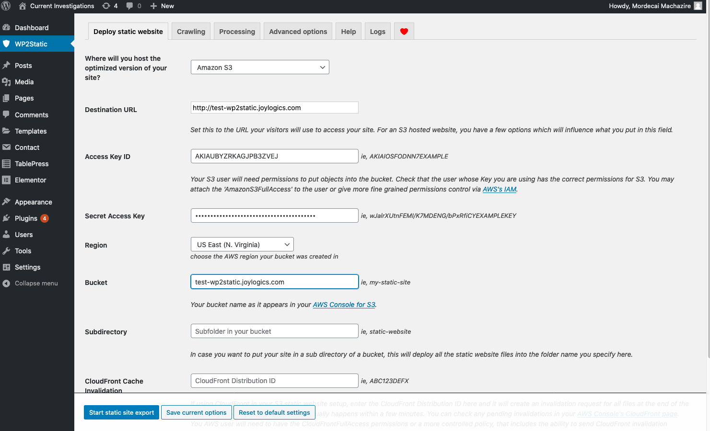

 AWS and WordPress can go together well 

## Introduction
Many people are using WordPress today to host websites that are primarily static. 
These are websites such as blogs that basically contain static content.
Such a website just needs to be updated when, e.g., a new article is written.

Today, static websites can be hosted in very cost-effective solutions like [AWS S3](https://docs.aws.amazon.com/AmazonS3/latest/dev/WebsiteHosting.html) and [GitHub Pages](https://pages.github.com/).

Using one of these services to host your website (instead of WordPress) will very likely:

* save money,
* be more secure,
* speed up the website, and
* lessen the need to manage/maintain WordPress and its host OS.

But WordPress is still a great way to actually create a website! 
This article is for those people who like the ease of creating websites via WordPress but wants the benefit of hosting their websites in AWS S3.

## Background
Recently, I decided to sign up as an 'expert' on [AWS IQ](https://aws.amazon.com/iq/) - it's a way for AWS customers to connect with third party consultants who are AWS experts.

There, I met [Mordecai Machazire](https://www.linkedin.com/in/mordecai-machazire-8279b4b0/), an impressive medical student, who is striving to learn data science. He had used AWS to provision an EC2 instance loaded with WordPress. 
And he in turn used WordPress to create a website with static content and then host it there.

The question he posed to me: "why is my simple website costing me $9 a month?"

Well, there are several ways to reduce the cost of hosting a website via WordPress:

* Try to use a smaller instance type.
* Pre-buy EC2 instance hours ("reserved instance").
* Migrate to LightSail.
* Migrate to another WordPress hosting service.

But the core of the problem is you're still paying for idle compute.

And this is the precise scenario where just saving the site as a "static website" and hosting it on S3 will practically reduce the cost to the less than $1/month range. Additionally you'd get the benefits I've outlined above.

After a quick Google search, I came across a nice WordPress plugin called WP2Static that can save a WordPress site as a static wite. And so with Mordecai's permission, I've decided to put together this article.

## Solution Outline
Here's the high-level workflow for "having your cake and eat it too."  
I.e., use WordPress, but host the website for low price.

* Use AWS EC2 instance for running WordPress, use this to build and preview your static website.
* Use AWS S3 for hosting the static website.
* Use the [WP2Static](https://wp2static.com/) plugin to push the site to S3.

And be sure to power-off the EC2 instance when not actively using WordPress for building/updating the website!

For more details, I've also put together a walk-through below.

## Caveats
Note that this solution is not for those people using WordPress to host sites that needs dynamism. 

For example, if you're hosting a forum where users are uploading their own content, then you do _not_ have a static website. 

While most modern websites have a separation of static content and dynamic content (which are hosted separately), architecting a website this way is well beyond the scope of this article.

## Walk-through
### Get an AWS account.
If you don't already have one - AWS makes this [easy](https://portal.aws.amazon.com/billing/signup#/start).

### Register your Domain and create Route53 zone for DNS.
You'll want to host your website on a domain you like - e.g., http://www.my-fantastic-static-website.com.
First you'll need to purchase/register that domain either on [AWS](https://docs.aws.amazon.com/Route53/latest/DeveloperGuide/registrar.html) or elsewhere. 
And then you'll need to [configure Route53 as your DNS service](https://docs.aws.amazon.com/Route53/latest/DeveloperGuide/dns-configuring.html).

### Create S3 based static site, and an IAM user.
I've created a CloudFormation template (open-sourced) to simplify this step.
You can find it [here](https://github.com/joylogics/cloudformation#s3_website_for_wp2staticyaml)
Note there is a launcher you can use to launch this template in your AWS console.

This will create a bucket with a name which matches your website (e.g., "www.my-fantastic-static-website.com"). It will also create an IAM user specifically for uploading the content from WordPress to S3. You'll need the credentials in the output section of the CloudFormation to provide wp2static later.

At this point you can point your web browser to the specified URL to verify that the URL is reachable.
You should get a 404 error however, since there is no content in that website as yet.

### Create WordPress EC2 instance
There are several walk-throughs for doing this. One easy way is to (again) leverage CloudFormation.
AWS has a sample template they've open-sourced [here](https://github.com/awslabs/aws-cloudformation-templates/blob/master/aws/solutions/WordPress_Single_Instance.yaml).
I've copied it into my repository and placed a launcher for it [here](https://github.com/joylogics/cloudformation#wordpress_single_instanceyaml).

Note you'll need to [create a key pair](https://docs.aws.amazon.com/AWSEC2/latest/UserGuide/ec2-key-pairs.html) in AWS first.

### Install wp2static in WordPress
Here are the steps:

* Navigate to WordPress admin site, then login 
* Go to 'Plugins' tab in left navigation bar.
* "Add New"
* Search for "wp2static"
* "Install Now"
* "Activate"

### Build your website!
I'm hardly the expert on actually using WordPress to build your website. But I know there are many plugins that make this simple. In particular [elementor](https://elementor.com/) seems quite popular, and this is in fact the one that Mordecai had used.

### Use wp2static to export the site to S3
Now, deploy to the S3 website using w2static. Go to the WP2Static tab in the WordPress admin site, then select "Deploy static website" tab in the top. Fill in the information in the UI using the information you've captured from the steps above. Here's an example screen shot:

Now, when you click on "Start static site export", the plugin will do all the heavy lifting of saving the site in S3.
When it's completed, click on "Go to my deployed site" to verify that your site is indeed live.

### Stop the WordPress EC2 instance!
Once you are happy with the website, make sure to stop the EC2 instance.
Just navigate to the [EC2 dashboard](https://console.aws.amazon.com/ec2/v2/home) on the AWS console, 
find the EC2 instance you've used, and stop (not terminate) the instance.
This effectively powers down that server, while the data is still on the EBS disk. 
When it's time to update the website again, return to the dashboard and start the instance.
(Note the public IP address will likely change.)

## After thoughts
There are several additional topics that I'll mention in this section all related to this workflow.

### Backup
I did not explicitly mention it, but it is absolutely a good idea to automate snapshotting the WordPress EC2 instance. This will allow you to restore to a previous point in time, in case you end up making a lot of changes to the WordPress site that you don't want to keep. 

At the very least, you can manually [take an EBS Snapshot](https://docs.aws.amazon.com/AWSEC2/latest/UserGuide/ebs-creating-snapshot.html) of the EC2 instance's EBS volume, or [create an AMI](https://docs.aws.amazon.com/AWSEC2/latest/UserGuide/creating-an-ami-ebs.html) of the EC2 instance. It's probably best to do this each time you stop the EC2 instance.

Alternatively, you can automate the backup process. There are two easy (and cost efficient) ways to do this: 

* [Amazon Data Lifecycle Manager](https://aws.amazon.com/premiumsupport/knowledge-center/ebs-snapshot-data-lifecycle-manager/) 
* [AWS Backup](https://aws.amazon.com/backup/). 

There are several third party solutions as well, but these are costlier and I would not recommend them for a simple workload like this.

### SSL
One thing you may have noticed is that this creates a static website with the "http" URL, and not "https". The latter requires a certificate to be provisioned and the "AWS way" to do this is by provisioning a CloudFront distribution.

CloudFront is a CDN (content delivery network) solution, and so this can also improve the website's performance as well.

If you want to do this, you will have to provision a certificate for your domain via ACM (Amazon Certificate Manager), create a CloudFront distribution, and set the S3 bucket as the "Origin" for your distribution.

### Staging
If you are provisioning a website which is getting a lot of traffic, you probably want to create a separate website to stage your updates. To do this, simply run the [CloudFormation template](https://github.com/joylogics/cloudformation#s3_website_for_wp2staticyaml) again, but this time using a different subdomain (e.g., "staging.my-fantastic-static-website.com"). 

Use the same methodology to deploy to this website, and once you are happy with the updates, you can deploy to the "production" site.

### Forms and Comments
As mentioned above under Caveats, static website means there is no server to, e.g., upload user content to. This means that common components such as WordPress based Forms and Comments will not work.

However, there are several external solutions that give a way for static website to still implement Forms and Comments. For example, my [blog site](https://urano.me) (which is static) uses [formspree](https://formspree.io/) to allow readers to contact me.

As for Comments, [here](https://darekkay.com/blog/static-site-comments/) is a good overview of various ways you can use.

### Login
Sometimes you want to create sections of your website that require login. This is well beyond the scope of this article, but this is possible by using CloudFront and creating a Lambda@Edge function that integrates with an Identity Provider (e.g., Cognito).

### Even Lower cost options
For those readers where even running an EC2 instance for a few hours per update is too much, there are other options here.

#### Lightsail
Instead of EC2 instance (a virtual machine node), you can use a VPS (virtual private server) where you are sharing the underlying resources with other "tenants". Amazon's VPS solution is called [Lightsail](https://aws.amazon.com/free/compute/lightsail/) and WordPress is in fact a common usecase.

#### Fargate
If you're more technically inclined, you can also spin up a [WordPress Docker Container](https://hub.docker.com/_/wordpress/) in ECS/Fargate.

#### Laptop/Desktop
And finally - you can always just install and run WordPress on your laptop (or desktop)! There are several guides for installing WordPress on your laptop. Keep in mind, though, this may become somewhat complicated if you decide to create and maintain multiple websites this way.

