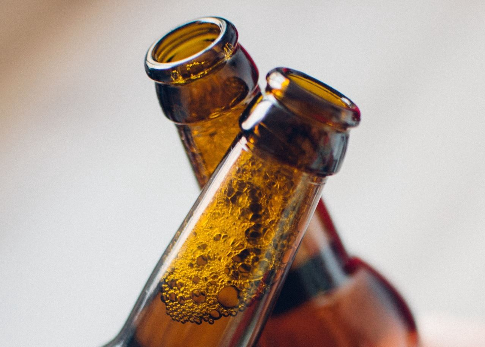
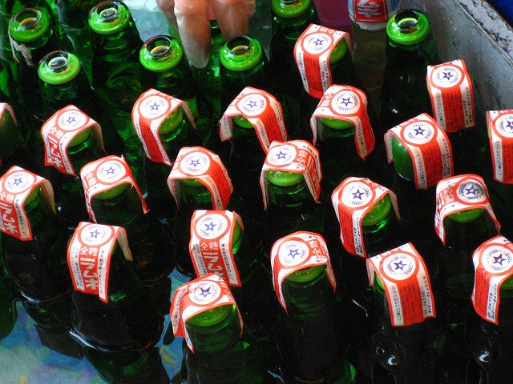

---
title: "Why I drink beer out of the bottle"
date: 2016-06-18
description: "I have a friend who always insists on having his beer poured into a glass to drink."
tags: [personal]
---

I have a friend who always insists on having his beer poured into a glass to drink.

I on the other hand almost always drink out of the bottle. (Though, yes, with polite company, I do try to act move civilized.)

It’s not laziness that I do this — it’s actually hero worship, for my dad.

You see, my dad grew up in post-war Japan. Life was hard back then. He grew up in a neighborhood in Osaka that had mostly burned down during the war.

In this backdrop, my great-uncle had decided to get into a soda bottling business. Now, that doesn’t sound much like a mom and pop business, but it was. The entire extended family including my grandfather worked hard in this business. Eventually they managed to own a small bottling shop and a machine that cleaned and bottled “ramune” soda — a popular drink in Japan still to this day.

bottles of ramune
 

The work in the shop was hard labor. After the bottles came out of the machine, they had to be labeled and boxed manually. And of course the heavy boxes had to be loaded onto a truck to be delivered to the customers.

My dad has many good stories from his days working there in his youth, spending arduous hours in hot summer days (when soda was popular.)

One story involves getting stopped by a policeman, and being cited for driving without a license. Of course, my dad was under aged for driving. But he had learned to drive a truck, so that he could make deliveries to the customers.

Many years have passed since then. My great-uncle has since passed, and the family business that he had started eventually lost out to big companies.

During those years, my dad continued to work hard, but in a very different sense. He was inspired by a doctor that lived in the neighborhood, and worked tirelessly to become a doctor himself. But he did not stop there. After specializing in oncology, he switched to focus on cancer research in order to help more people. He eventually earned a PhD and a professorship.

When I was born, my dad was well on his way on this successful career. We immigrated to the US when I was young, and my experience of growing up is largely that of a mid-upper class suburbanite.

It was one hot summer day that he shared this story — with a certain fondness for those sweltering summer days in Osaka toiling in great-uncle’s shop. Those days are a part of his roots, and a basis for his discipline and character that has served him well.

And on that day, after opening a bottle of beer, he said slyly, “You see, I’m really a blue-collar person. I drink beer right out of the bottle.”

He may not remember it, somehow that message stuck with me. While I have similarly followed in a decidedly white collar career, I harbor that fondness and respect for the blue collar spirit. It’s the spirit of getting things done.

So, on this Father’s Day, I’ll be having a beer, straight out of the bottle. Happy Father’s Day, and Cheers!

